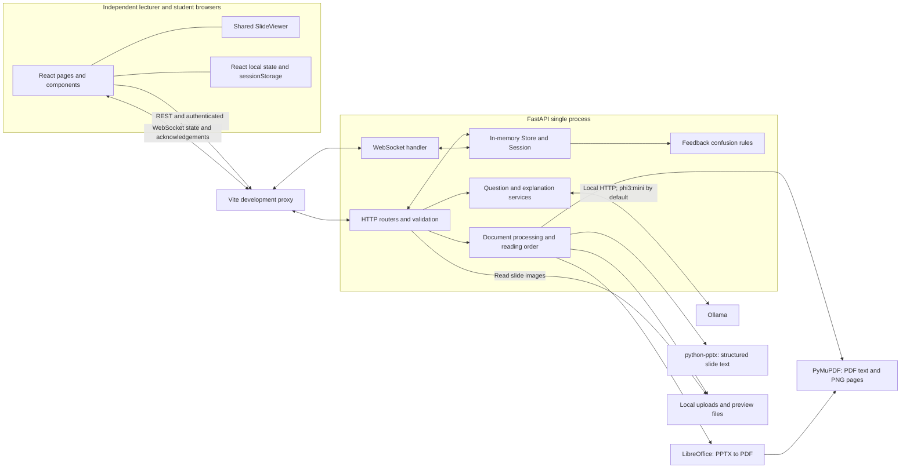

# Architecture and UI audit

**Project:** AI-Based Adaptive Interactive Learning Platform for Real-Time Classroom Engagement  
**Date:** 28 September 2026  
**Scope:** Analysis and proposed design only. No application implementation, dependency installation, database migration, commit or push is part of this audit.

## 1. Executive summary

The code implements all eleven prototype capabilities listed in the audit request, including Milestone 5 explanations and anonymous questions. It already has Prepare, Live class and Results workspaces, a shared slide viewer, local zoom and presentation modes. A replacement application or another layer of tabs is unnecessary. The refinement should make the existing tasks easier to see and complete.

The most urgent problem is the live workspace geometry. At 1366 × 768, the feedback panel and multiple navigation/header rows leave only **260 px** of visible tool content. Activity release and explanation review actions require scrolling inside that small space. At 1024 × 768, the lecturer page grows to 838 px and the slide panel extends below the initial viewport. Results also spends 267 px on the current-slide feedback panel before showing answer results.

Other concrete findings are a student Half-screen option that does not actually change desktop column widths, generation notices that remain misleading after questions are released, lengthy repeated instructions, and increasingly complicated state/layout responsibilities in `LivePage` and `LecturerActivities`.

The actual architecture is React/Tailwind/Vite → FastAPI HTTP/WebSockets → an in-memory session, local document files and local Ollama. **MySQL, SQLAlchemy and JWT are not implemented.** There is one active session, no saved lecture catalogue, no attendance register and no durable results archive. Temporary identity duplication, complex PPTX conversion and extraction reading order remain limitations. They should not be presented as solved by the UI work.

**First recommended task:** repair the Live class viewport and sidebar structure, keeping slide navigation and a compact understanding summary visible while giving the selected task one useful scrolling region. Verify this at laptop dimensions before making broader visual changes.

## 2. Evidence and inspection boundaries

### Sources inspected

- [README](../README.md), milestone documentation [1](milestone-1-tests.md), [2](milestone-2-tests.md), [3](milestone-3-tests.md), [4](milestone-4-tests.md), [4.1](milestone-4.1-tests.md), [5](milestone-5-tests.md), and [workspace/viewer verification](ui-workspace-tests.md).
- Frontend pages, components, CSS, API client, socket hook, package manifest and Vite/Playwright configuration.
- Backend routes, session store, WebSocket handler, feedback rules, document processing, reading-order logic, activity and explanation prompts/validation.
- Six backend test modules and seven browser spec files, plus fake Ollama and document fixtures.

### Current rendered inspection

The application was run on isolated audit ports using the existing Python environment, Node packages, Playwright Chromium and fake Ollama. Inspection covered Home, Prepare, activity generation/review/release, Live class, feedback, explanations, anonymous questions, Results, student views and session ending. A synthetic two-page PDF and two independent student browser contexts were used. Screenshots and geometry measurements were captured at 1366 × 768, 1024 × 768 and 390 × 844. Temporary inspection artifacts are outside the source tree.

A separate focused browser check confirmed equal lecturer Half-screen columns, actual `document.fullscreenElement` entry, lecturer navigation at 125% zoom in full screen, and Escape restoring Standard view. No JavaScript page errors were recorded in the main exploratory run.

This is **not** a fresh full regression certification: the automated suites and production build were inspected as existing evidence, not rerun for this documentation-only change. Real Ollama output quality, new PPTX conversion cases, Safari/Firefox, physical mobile browsers, screen readers and classroom-scale load were not retested. Source findings and rendered observations are identified below rather than treating every observation as an automated test pass.

### How to interpret the existing test records

| Evidence | Meaning |
| --- | --- |
| User reports all 20 Milestone 5 manual tests passed | Accepted as the user's latest manual evaluation; not claimed as independently repeated here. |
| Milestone 5 document records 46 backend tests, 10 Chromium tests and a successful 42-module build | Historical implementation verification. The recorded manual-testing status predates the user's newer report. |
| Earlier workspace document records 9 browser tests and a 40-module build | Historical pre-M5 result, not the current suite size. Its statement that M5 is absent is now historical. |
| Existing PDF/PPTX fixtures and real-model records | Evidence for those inputs/configurations only, not all presentations or model outputs. |
| Current browser inspection | Direct evidence of present layout defects, including defects not asserted by the existing tests. |

Passing functional tests does not establish usability, learning effectiveness, rendering accuracy for every slide or reliable academic difficulty classification.

## 3. Actual existing architecture

### 3.1 Runtime structure

The browser runs React 19 with custom CSS and Tailwind 4, built by Vite 7. HTTP requests use the existing `fetch` wrappers; the browser WebSocket API provides session updates. There is no frontend routing library or global state dependency.

FastAPI creates one `Store` and one `OllamaClient` in application state. Pydantic validates requests. The store holds one session and an asynchronous lock. The server authenticates opaque temporary tokens; these are not JWTs. Rendering work is moved to a worker thread, and AI HTTP requests are awaited outside the store lock so slide navigation and feedback can continue while generation runs.

The development frontend proxies `/api` and `/ws` to FastAPI. The documented LAN demonstration uses the lecturer computer's frontend address. This development arrangement is not a production deployment architecture. The in-memory store requires one backend process/worker for a consistent classroom.



Sources: [main.py](../backend/app/main.py), [store.py](../backend/app/store.py), [Vite configuration](../frontend/vite.config.js), [frontend dependencies](../frontend/package.json), [backend dependencies](../backend/requirements.txt).

### 3.2 Frontend routes and component inventory

There are no separate implemented `/prepare`, `/live` or `/results` routes. `App` switches between Home and the classroom according to credentials. Workspace changes are local React state within the same page. Browser refresh restores credentials, but not every draft, selected tool, viewing mode or workspace selection.

| File/component | Current responsibility |
| --- | --- |
| [main.jsx](../frontend/src/main.jsx) / [App.jsx](../frontend/src/App.jsx) | React root, credential restoration, create/join/leave flow, Home versus classroom. |
| [HomePage](../frontend/src/pages/HomePage.jsx) | Lecturer title/create form, student code/join form, guidance and errors. |
| [LivePage](../frontend/src/pages/LivePage.jsx) | Both role layouts; one socket hook; session header/end confirmation; source following; lecturer/student tabs; next-action guidance; slide mode and panel visibility. |
| [useSessionSocket](../frontend/src/hooks/useSessionSocket.js) | Authentication frame, heartbeat, reconnect, snapshots, command sending, feedback/activity request IDs and acknowledgements. |
| [api.js](../frontend/src/services/api.js) | Session, upload, activity, explanation and anonymous-question HTTP calls and errors. |
| [SessionStatus](../frontend/src/components/SessionStatus.jsx) | Connection state, synchronisation status, connected-student count. |
| [WorkspaceTabs](../frontend/src/components/WorkspaceTabs.jsx) | Shared stage/tool navigation, selection and horizontal keyboard handling. |
| [SlideViewer](../frontend/src/components/SlideViewer.jsx) | Authenticated image fetch, extracted-text fallback, fit calculation, zoom, scroll, presentation modes, fullscreen handling, lecturer-only navigation. |
| [MaterialUpload](../frontend/src/components/MaterialUpload.jsx) | Choose/upload/replace document, busy state, warnings and errors. |
| [LecturerActivities](../frontend/src/components/LecturerActivities.jsx) | Source selection, notes/difficulty, AI generation, filtering/selection, draft management, review/release and Results. Contains `QuestionEditor`, `ActivityRelease` and `ActivityResults`. |
| [StudentActivities](../frontend/src/components/StudentActivities.jsx) | All released activity forms, per-activity answer drafts, submissions and update acknowledgements. |
| [UnderstandingFeedback](../frontend/src/components/UnderstandingFeedback.jsx) | `StudentFeedback` response controls; `LecturerFeedback` combined green/red bar, counts, flags, rule details and explanation entry action. |
| [LecturerExplanations](../frontend/src/components/LecturerExplanations.jsx) | Source preview, generation, explanation selection/editing, approval, discard/share, history and status. |
| [AnonymousQuestions](../frontend/src/components/AnonymousQuestions.jsx) | `LecturerQuestions` grouped by slide, `StudentQuestion` submission and per-slide drafts, `SharedExplanations` grouped by slide. |
| [styles.css](../frontend/src/styles.css) | Tailwind base/component rules plus custom shell, grid, panel, viewing-mode and responsive overrides. |

The private activity-form component and the anonymous-question form both use the name `StudentQuestion` in separate files. This is valid JavaScript but unnecessarily ambiguous when restructuring the code.

### 3.3 Backend module inventory

| Module | Responsibility |
| --- | --- |
| [routes.py](../backend/app/routes.py) / [slides.py](../backend/app/slides.py) | Health, session create/join, five sample slides. |
| [store.py](../backend/app/store.py) | Session lifecycle, tokens/connections, role snapshots, revisions and broadcasts. |
| [realtime.py](../backend/app/realtime.py) | WebSocket authentication, role checks, navigation, ending, feedback and student answers. |
| [materials.py](../backend/app/materials.py) | Upload validation, presentation replacement and authenticated slide-image delivery. |
| [document_processing.py](../backend/app/document_processing.py) / [reading_order.py](../backend/app/reading_order.py) | PDF/PPTX extraction, conversion/rendering and heuristic reading order. |
| [activities.py](../backend/app/activities.py) / [ai_generation.py](../backend/app/ai_generation.py) | Activity lifecycle, responses/aggregates, Ollama client, question prompt and validation. |
| [feedback.py](../backend/app/feedback.py) | Configurable respondent-based confusion rule. |
| [adaptive.py](../backend/app/adaptive.py) / [explanation_generation.py](../backend/app/explanation_generation.py) | Explanation lifecycle/version checks, anonymous questions, explanation prompt and validation. |

### 3.4 HTTP API inventory

All application HTTP routes below include the `/api` prefix. Protected requests use `Authorization: Bearer <temporary token>`. Identifiers are opaque. Source indexes are zero-based; the image URL's slide number is one-based.

| Method and path | Access | Behaviour / principal input |
| --- | --- | --- |
| `GET /api/health` | Public | Reports status, in-memory storage and milestone 5. |
| `POST /api/sessions` | Public | `{title}`; creates session and returns lecturer credentials. Rejects another active session. |
| `POST /api/sessions/{code}/join` | Public | Optional `{previous_token}`; reuses a recognised student identity or issues new credentials. |
| `POST /api/sessions/{code}/materials` | Lecturer | Multipart `file`; uploads and replaces active presentation. |
| `GET /api/materials/{material_id}/slides/{slide_number}/image` | Session member | Current material's PNG preview; no-store caching. |
| `GET /api/sessions/{code}/activities/ai-status` | Lecturer | Checks configured Ollama/model availability; not currently exposed as a frontend status feature. |
| `POST /api/sessions/{code}/activities/generate` | Lecturer | `{presentation_id, slide_index, teaching_notes?, difficulty?}`; creates private pending activities. |
| `PUT /api/sessions/{code}/activities/{activity_id}` | Lecturer | `{question}`; edits pending/approved question, requires approval again. |
| `POST /api/sessions/{code}/activities/{activity_id}/{action}` | Lecturer | `approve`, `discard` or `release`, subject to lifecycle checks. |
| `POST /api/sessions/{code}/explanations/generate` | Lecturer | `{presentation_id, slide_index}`; creates private pending explanation. |
| `PUT /api/sessions/{code}/explanations/{explanation_id}` | Lecturer | `{version, text}`; checks version, edits and requires approval again. |
| `POST /api/sessions/{code}/explanations/{explanation_id}/{action}` | Lecturer | `{version}` with `approve`, `share` or `discard`. |
| `POST /api/sessions/{code}/anonymous-questions` | Student | `{presentation_id, slide_index, text}`; validates current slide, stores question and acknowledges it. |

FastAPI also exposes its default OpenAPI/documentation endpoints. There is no session-list, saved-lecture, historical-results, export or attendance API. Session ending is a WebSocket command, not a REST endpoint.

### 3.5 WebSocket contract and data flow

Endpoint: `/ws/sessions/{code}`. The first frame supplies `{token}` within the authentication timeout. The server resolves the role, sends a role-specific snapshot and broadcasts connection changes. Invalid/unavailable sessions use application close codes. Clients heartbeat and reconnect automatically; ending broadcasts the ended status and closes connections.

| Direction | Message | Meaning |
| --- | --- | --- |
| Client → server | Initial `{token}` | Authenticate connection; not a navigation event. |
| Client → server | `ping` | Keepalive; server returns `pong`. |
| Lecturer → server | `set_slide {index}` | Change authoritative current slide. |
| Lecturer → server | `end_session` | End session for everyone. |
| Student → server | `submit_feedback {slide_index, choice, presentation_id, request_id}` | Current-slide response; latest response replaces the same token's previous choice. |
| Student → server | `submit_activity {activity_id, answer, presentation_id, request_id}` | Submit/update answer to a released activity. |
| Server → client | `state` | Complete permitted session snapshot, including revision. |
| Server → client | `feedback_ack {slide_index, choice, request_id}` | Confirm matching feedback request. |
| Server → client | `activity_ack {activity_id, request_id}` | Confirm matching activity request. |
| Server → client | `error {message}` | Explain invalid/unauthorised commands. |
| Server → client | `pong` | Heartbeat acknowledgement. |

HTTP activity/explanation/question mutations also broadcast `state`; there are no separate explanation or anonymous-question WebSocket event types.

Common snapshot fields include code, title, status, current slide, slides, revision, presentation/material metadata, connected-student count and lecturer connection state. Lecturer snapshots include private activity records and aggregates, generation flags, explanation records/history, anonymous questions, current feedback, flagged-slide indexes and rule settings. Students receive their current-slide feedback, safe released activities with their own answer, and shared explanation text. Pending/approved private AI content, lecturer answer keys and explanation source/history are excluded from student activity/explanation payloads.

All slide source data is part of the session snapshot: the navigation restriction is not a promise that other slide content is secret. The client replaces its snapshot on updates; although revisions are supplied, it does not implement a revision-order reconciliation layer.

**Examples of the actual flow:**

1. Lecturer Next → `set_slide` → server validates role/index → updates session → snapshots → students render current slide. Lecturer source selection follows this change; selecting a different generation source alone does not send `set_slide`.
2. Student feedback → validation and token-keyed overwrite → feedback acknowledgement and updated snapshots → lecturer bar/flag. A flag does not call Ollama.
3. Lecturer Generate → HTTP service checks/captures source → awaits Ollama outside the store lock → validates output/session/presentation → pending record and snapshot. Lecturer review/approval and a separate release/share action remain necessary.
4. Student anonymous question → authenticated HTTP validation → author-free question record → lecturer snapshot and student HTTP acknowledgement. It is not a group chat.

Full snapshots and network sends under the store lock are simple prototype choices. Broadcast uses parallel sends with timeouts, but large decks/history and many clients can still increase latency. No classroom-scale load guarantee was found. UI refinement should leave these contracts alone.

### 3.6 State and storage

| Data | Actual storage and lifetime |
| --- | --- |
| Session | One `Store.session`: code, title, active/ended status, lecturer token, student tokens, connections and revision. Lost on backend restart; replaced by a subsequent session. |
| Slides/material | Session metadata/list/current index; uploaded originals and rendered PNGs in ignored `backend/storage` directories. Files on disk do not restore lost session metadata. One active material, no library. |
| Understanding | In-memory map of slide → student token → latest choice. Counts/percentages and flags computed from responses. |
| Activities | In-memory records: source, original/current question, notes/difficulty/model/timing, status/history, token-keyed answers and aggregate results. |
| Explanations | In-memory records: source text/quote, original/current text, model/timing, status, review history and version. |
| Anonymous questions | In-memory records contain ID, session code, presentation ID, slide index and text; no author-token/identity field. |
| Browser credentials | `sessionStorage` keys `classroom-milestone1` and `classroom-last-student`; temporary access/rejoin identity, not an account. |
| UI preferences/drafts | React state: workspace, source selection, tools, mode, zoom, activity/explanation edits, notes and per-slide anonymous question drafts. These are not all persisted across refresh. |

Replacing a material resets the authoritative slide, feedback, activities/answers, explanations and anonymous questions. Presentation keys also reset associated local editors. This destructive existing behaviour must be made clear in the replacement UI.

Hidden mounted panels currently preserve draft state across tool/workspace changes. Replacing them with conditional mounting without lifting state would silently lose drafts. Keep one socket owner and one persistent viewer instance when refining the shell.

### 3.7 Document and AI processing

**Documents.** PDF uses PyMuPDF to extract native text and render page images. PPTX uses python-pptx to extract text/tables and LibreOffice to convert slide visuals through PDF into images. Without LibreOffice, the application uses labelled text-only PPTX fallback. Existing OLE/table handling and reading-order heuristics improve selected cases; neither guarantees complex PowerPoint fidelity or correct reading order for every layout. There is no OCR or understanding of image-only diagrams. Legacy `.ppt` is rejected by the backend. Upload size defaults to 25 MB and is configurable.

**Activities.** The shared asynchronous Ollama client defaults to local `phi3:mini`, checks model availability and requests JSON output. The default request generates two MCQs and one fill-in-the-blank; counts, timeout and generation settings are configurable. Selected source text, optional separately retained teaching notes and requested difficulty feed the prompt. Validation checks question structure and source grounding heuristics. Requested difficulty is not independently proven. Insufficient/fragmented source, hallucination or unusable model output can still require lecturer intervention. No model training or automatic release occurs.

**Explanations.** A separate explanation prompt uses the selected slide's extracted source, requests simple undergraduate English and a supporting source quote, and validates the structured response and source relationship. It does not use the activity teaching-notes field. The prompt's short-length target and topic/quote checks do not prove every sentence is academically correct. Original content/history is retained for lecturer review; saving edits returns an explanation to pending. Approval alone does not share it. Version checks protect explanation edits/actions from stale updates; activity editing does not have the same version field.

**Confusion.** Defaults are at least two respondents and at least 50% Not Understand **among respondents**, configurable through environment settings. Nonrespondents are not counted as Understand. Flags describe self-reported potential confusion, not an individual diagnosis or inferred learning outcome. The lecturer can request an explanation even without a flag; the rule never triggers generation or sharing.

## 4. Implemented scope and remaining limitations

| Capability | Assessment |
| --- | --- |
| Create/join/reconnect/end session | Implemented with temporary tokens and one active session. No login, durable lecture selection or multiple simultaneous classrooms. |
| Pre-class preparation | Implemented as UI workflow inside an already active session. No persisted preparation phase or server-side Start class gate. |
| PDF/PPTX upload/preview/extraction | Implemented with text-only fallback and known rendering/extraction limits. Complex-table and reading-order limitations remain. |
| Generate activities before/during class | Implemented; asynchronous generation remains separate from classroom WebSocket interaction. |
| Review/edit/approve/release activities | Implemented with explicit release and private drafts. Editing invalidates approval. |
| Student answers/results | Implemented per-activity aggregates and own-answer updates. No semantic blank-answer grading or student gradebook. |
| Live slides and local viewing settings | Implemented, including role enforcement; student Half-screen layout has a concrete CSS defect. |
| Feedback/confusion | Implemented, respondent-based. New credentials still create another identity/count. |
| AI simplified explanations | Implemented on lecturer request with private review, version checks and explicit share. No automatic adaptation or sharing. |
| Anonymous questions | Implemented, grouped by slide with no stored author field. Authenticated submission still uses a student token; this is application-level anonymity, not network anonymity. |
| MySQL / SQLAlchemy / JWT | Proposed architecture items only; absent from current implementation. Out of scope for this refinement. |
| Attendance, historical analytics, exports, saved lecture catalogue | Not implemented; do not add placeholder navigation or pretend connected clients are attendance. |

**Temporary identity issue:** same-token feedback overwrites correctly; ordinary reconnect/refresh and supported same-tab rejoin can retain identity. A new browser context or rejoin without a recognised previous token still creates a new identity. The backend has no durable person identity with which to merge those responses. The earlier duplicate-feedback limitation is mitigated for token reuse, not fundamentally eliminated.

**Persistence:** stopping/restarting the backend loses the session, approvals, answers and results. Keeping an uploaded file on disk is not persistence of the classroom. Before-class preparation therefore requires the same running backend to survive until teaching.

## 5. Actual workflows

### Lecturer

1. Home → enter title → Create lecture session. App stores temporary credentials and opens Prepare with sample slides. Existing credentials restore the current session; there is no saved-session picker.
2. Upload PDF/PPTX → inspect source preview/extracted text → select source → optionally add notes/difficulty → Generate questions. The preview/source selector does not move the classroom slide.
3. Select a generated question → edit/save if needed → approve or discard. Approved activities are retained privately until explicitly released. Release is available through existing review/live controls; Prepare is not a backend barrier to release.
4. Select Live class → share session code → navigate the live slide. Students follow. Source changes follow classroom navigation; manual source selection remains local.
5. Monitor combined feedback bar and confusion flag. Release approved activities, or generate more and review/approve/release through the same lifecycle while teaching.
6. Explain this slide opens the explanation task; Generate explanation is still an explicit action. Review/edit/save, approve, then explicitly share, or discard. Anonymous Questions displays student text grouped by slide.
7. Results displays released-activity selection, answer counts/distributions and a small aggregate overview. It currently also shows the live feedback panel.
8. Confirm End session. Existing browser state can remain visible with controls disabled, but this is not a durable results archive.

### Student

1. Home → enter six-character session code → join. The server's current slide appears, including for a late join.
2. Follow lecturer slide; independently choose view/zoom. No Previous/Next permission.
3. Submit Understand/Not Understand for the current slide; response can be changed, with acknowledgement or error status.
4. Open released activities and submit/update an MCQ or blank answer. Already released activities remain available; navigation does not automatically close them.
5. Read only lecturer-shared explanations. Submit an anonymous question about the current slide; drafts are associated with their slide.
6. On mobile, switch Slide/Class tools, then Activities/Explanations/Ask a question. Leave or return home after ending; supported rejoin can reuse the previous identity.

## 6. UI audit findings

### 6.1 Priority findings with evidence

| Priority | Finding and evidence | Proposed response |
| --- | --- | --- |
| P1 | **Live actions are crowded out.** At 1366 × 768: 267 px feedback panel, 260 px tool viewport with 713 px activity content or 955 px explanation content. Outer tool tabs, inner question tabs, headings and source selector consume much of the visible area. | Compact persistent feedback summary; one task selector; task body with one main scroll region and readily reachable actions. |
| P1 | **Laptop navigation falls below the viewport.** At 1024 × 768 the document is 838 px high, slide panel starts at y=266 and ends at y=818. Fixed viewport subtraction does not accommodate the rail becoming several top rows. | Let the shell allocate remaining height with flex/grid; shorten responsive header/guidance; assert navigation within the initial viewport at supported laptop sizes. |
| P1 | **Stale generation status contradicts released state.** Rendered Live/Results still said “3 questions ready for review. Nothing was released.” after approval/release. Notice is local state only cleared by generation/presentation change. | Scope completion notices to the generation task; dismiss/replace after lifecycle changes. Derive current counts/statuses from the snapshot. Preserve real errors. |
| P1 | **Student Half-screen does not split equally.** Standard and Half-screen both measured about 909/390 px at 1366 wide. Later `.student-shell .workspace-grid` overrides `.workspace-grid.mode-half`. Lecturer half measured equal columns. | Correct mode-specific student styling and assert actual widths, not just dropdown value/aspect ratio. |
| P2 | **Results loses hierarchy.** Its full-width current feedback panel consumed 267 px, leaving a 321 px results viewport. Explain this slide remains available here. | Lead with supported result summary and selected activity; keep feedback details collapsible/secondary and explanation work in Live class. |
| P2 | **Preparation action is buried.** Upload plus workbench exceeds the right column; open extracted text, notes, source selection and instructions push Generate below view. Review also nests a capped list inside the panel scroll. | Compact current material row; source beside preview; collapsed source/history details; list/detail review task with accessible action area. |
| P2 | **Mobile has two navigation levels before the task.** At 390 × 844, header, status, Slide/Class tools, feedback and inner tabs put an activity well down the page. One sample MCQ made the page 900 px high; all released cards stack. No horizontal overflow was observed. | One mobile task navigation; concise feedback strip; selected activity or current-slide-first grouping with access to all released activities. Long content can still scroll. |
| P2 | **Counts/labels are ambiguous.** Lecturer “Questions” means incoming student questions, while “Prepare questions” means generated activities. Student “Class tools (N)” combines activities and explanations, not unread items. | Use “Student questions”, “Activities”, “Shared explanations”; label counts by what they count. Do not introduce unread claims without read-state logic. |
| P2 | **Guidance and permanent copy compete with work.** Home repeats its purpose; rail has an Up next title/detail/button; panels repeat headings and policy text. Global next-step priority can distract from the Results task. | One concise empty-state action or task-specific hint. Keep necessary source limitations and release/privacy information near the relevant decision. |
| P2 | **Upload UI contradicts support.** File input accepts `.ppt` although backend rejects it; format/25 MB hint is hidden by a CSS selector. Replacement warning omits explanations and anonymous questions that are also reset. | Align picker with PDF/PPTX, restore concise visible hint, list all cleared data in replacement explanation. Keep the configured-limit caveat in technical docs. |
| P2 | **AI progress/errors are easy to miss after switching panels.** Busy/error states exist inside task panels; no concise persistent cross-panel progress/result cue. | Reuse generation flags plus local request state for a small “Generating…”/“Ready for review” cue linking back to the relevant task. Never automatically open/share/release. |
| P2 | **Accessibility linkage is incomplete.** `WorkspaceTabs` has labels, selected state and Left/Right/Home/End handling, but no linked `tabpanel`/`aria-controls`; vertical stage navigation does not declare orientation or support Up/Down. | Choose navigation semantics intentionally, link tab panels, support correct orientation/focus. Check hidden panels and mobile transitions with keyboard. |
| P3 | **Viewer duplicates actions.** Reset and Fit call the same function: zoom=100% relative to fitted size and scroll origin. Fullscreen retains the larger toolbar/caption instead of minimal presentation controls. | Make equivalent behaviour explicit and compact; preserve reset and fit capability. Reuse the one viewer and simplify fullscreen controls. |
| P3 | **Image error recovery is limited.** Fetch failure falls back to text, but there is no explicit Retry control, fetch timeout or image-decode error handler. | Consider a focused retry/error-state improvement after essential layout work; preserve fallback. Do not block the day on a new rendering pipeline. |

### 6.2 What already works and should be retained

- A coherent lecture-desk concept, distinct lecturer/student entry forms and clear three-workspace navigation already exist.
- The slide remains separate from independently scrolling desktop tools; the problem is not that every current screen is one unbounded stacked page.
- The lecturer feedback bar already combines green Understand and red Not Understand, with text counts/percentages and accessible description. Colour is not the sole signal.
- Home errors, classroom loading, connection/reconnect/end messages, upload progress/errors, empty activities/results, generation errors and review statuses are implemented.
- Feedback and answer controls wait for matching acknowledgements and display timeout guidance. Anonymous questions have busy/success/error states.
- Explicit approve/release/share actions and original AI/history disclosures exist. No automatic AI intervention is needed for the redesign.
- Zoom preserves image proportions and supports scrolling. Students' view settings are local. Existing hidden editors preserve unsaved drafts across navigation.

### 6.3 Component responsibility and CSS risks

`LivePage` combines transport ownership, role composition, workspace navigation, source following, contextual guidance and presentation layout. `LecturerActivities` combines several distinct tasks and two different workflows (preparation and live release), plus Results. `AnonymousQuestions.jsx` groups three user-facing features with different roles. These are reasonable extraction boundaries, not reasons to replace the underlying requests or state machines.

`styles.css` contains earlier and later definitions of grids, mode selectors and breakpoints. The student Half-screen override is a demonstrated consequence. Prefer a small set of explicit shell/mode rules; avoid stacking another round of selectors on top. Do not lower font sizes or clip question text to make panels appear to fit. Long titles/prompts/options must wrap, list entries must grow naturally, and controls must remain reachable.

## 7. Proposed information architecture

### 7.1 Design concept and navigation

Keep one **lecture workspace**: prepare the material, teach from the slide, review responses. Use restrained existing colours and familiar labels. Guidance should identify the next action when needed, then give the space back to the content.

```text
Home
  Lecturer: title → Create session
  Student: code → Join class

Current lecturer session (one persistent connection)
  Prepare    → Material/source → Generate → Review/approve/discard
  Live class → Slide + understanding + ONE selected task
                Activities | Explanations | Student questions
  Results    → Released activity list + selected response summary

Student classroom (one persistent connection)
  Slide | Activities | Explanations | Ask
  Current-slide feedback remains easy to reach
```

These remain local views. Do not add a router or pretend switching to Live class starts a new backend phase. “Create or select a lecture” means create a session or return to the currently restored session; selecting saved lectures needs future persistence/API work and is outside this plan.

Keep session title, code/copy, connection and connected count in a compact common header. End session remains an explicit confirmed action. On laptops use a short horizontal workspace navigation instead of a tall rail plus a large Up next block. On large desktops a compact rail is acceptable if it does not reduce task space unnecessarily.

### 7.2 Prepare wireframe

```text
Lecture title                Code [Copy]   Connected 0   [End session]
Prepare | Live class | Results
┌───────────────────────────────────┬────────────────────────────────┐
│ Material: lecture.pdf  [Replace]   │ Activities: 3 pending / 2 approved│
│ Source: [Slide 4 ▾]                │ [Generate] [Review]            │
│ [View ▾]  [−] 100% [+] [Fit/Reset] │                                │
│                                   │ GENERATE                       │
│                                   │ Source text ▸                  │
│          SOURCE PREVIEW           │ Teaching notes (optional)      │
│                                   │ Difficulty [Basic ▾]           │
│                                   │ [Generate questions]           │
│                                   │                                │
│                                   │ OR REVIEW                      │
│                                   │ [Question selector/list]       │
│                                   │ Question + choices + answer    │
│                                   │ Original / history ▸           │
│ Extracted text ▸                  │ [Save] [Approve] [Discard]     │
└───────────────────────────────────┴────────────────────────────────┘
```

Generate and Review are alternative task bodies, not stacked forms. Before upload, show a single upload empty state with PDF/PPTX support and sample preview clearly labelled. After upload, collapse the uploader to material status/Replace. Keep existing review/release functionality reachable; approved items can offer the existing explicit Release action, with Live class as the normal release workflow. No implicit release when entering Live class.

Source preview is independent of the students' current slide. Make that distinction concise and visible where source changes matter. Long source text, original JSON and history remain accessible in disclosures. Show warnings/errors beside the action they affect.

### 7.3 Live class wireframe

```text
Lecture title         Code [Copy]   Connected: 18   ● Connected   [End]
Prepare | Live class | Results
┌──────────────────────────────────────────┬──────────────────────────┐
│ [View ▾] [−] 100% [+] [Fit/Reset] [⛶]     │ Understanding · Slide 4  │
│                                          │ [ green 60% | red 40% ]  │
│                                          │ 10 responses · details ▸ │
│                                          │ Flag when applicable     │
│                                          ├──────────────────────────┤
│              CURRENT SLIDE               │ Activities | Explanations│
│                                          │ Student questions (2)    │
│                                          ├──────────────────────────┤
│                                          │ SELECTED TASK            │
│                                          │ Approved activity        │
│                                          │ [Release] [Review/edit]  │
│                                          │ [Generate more]          │
│                                          │                          │
│ [Previous]       Slide 4 / 12      [Next] │ Task status/action area  │
└──────────────────────────────────────────┴──────────────────────────┘
```

The understanding summary is compact and persistent; rule explanation/flagged-slide list move into details. The combined bar, respondent count, flagged state and Explain entry remain accessible. “Explain this slide” opens the explanation task without generating anything.

Activities initially shows an approved/released selection and its action. Generate more and Review/edit open the existing respective task within this same panel with a clear Back to activities action. Do not place another permanent inner tab row above every live activity. Explanations similarly gives the selected record/editor useful space and keeps source/history collapsed until requested. Student questions retains slide grouping with natural wrapping.

At normal laptop sizes, the header, slide navigation and feedback summary fit without page scrolling. Only the selected task body scrolls where needed; a visible action area must not cover its last field or error. During generation, keep slide navigation and feedback enabled and show a concise job status. Generated content waits for lecturer review and explicit release/share.

### 7.4 Results wireframe

```text
Lecture title                     Code        ● Connected   [End]
Prepare | Live class | Results
Released activities: 5     Answers submitted: 42     Flagged slides: 2
┌──────────────────────────────┬─────────────────────────────────────┐
│ Released activities          │ Slide 4 · Multiple choice           │
│ Slide 2 · Question ...       │ Full question                       │
│ Slide 4 · Question ... ◀     │                                     │
│ Slide 5 · Question ...       │ A. Answer text                 4    │
│                              │ B. Answer text                 8    │
│                              │ C. Answer text                 1    │
│                              │ D. Answer text                 0    │
│                              │ 13 submissions · correct option B   │
│                              │ OR submitted blank-answer frequencies│
└──────────────────────────────┴─────────────────────────────────────┘
Current-slide understanding / flagged slide numbers ▸
```

Only use current payload data: released-activity count, summed per-activity submissions, per-option distribution, submitted blank-answer frequencies, current feedback and flagged indexes. “Answers submitted” is a sum across activities, **not unique students**. Connected students is a current connection count, **not attendance**. The current API does not supply a complete historical per-slide response series, grades, learning gains or a durable report. Do not add trend charts or fake analytics. Preserve current feedback details as a secondary disclosure instead of a dominant panel.

### 7.5 Student wireframe

Desktop keeps the slide large beside one selected task; feedback remains compact and visible. Half-screen gives slide/task approximately equal widths. At narrow widths use one short navigation row and one task at a time:

```text
┌──────────────────────────────────┐
│ Lecture title     ● Connected    │
│ Code ABC234              [Leave] │
├──────────────────────────────────┤
│ Slide | Activities (2) | Explain │
│                       Ask       │
├──────────────────────────────────┤
│ SLIDE VIEW                       │
│ [View ▾] [−]100%[+] [Fit] [⛶]   │
│                                  │
│        CURRENT SLIDE             │
│                                  │
│ Slide 4 of 12                    │
├──────────────────────────────────┤
│ Slide 4: [Understand] [Not yet]   │
│ Response saved                   │
└──────────────────────────────────┘

Selecting Activities replaces the main body:
  [Activity selector / current-slide group]
  Full prompt → options/answer → [Submit / Update]
  Previously released activities remain accessible

Selecting Explain: lecturer-shared explanations grouped by slide
Selecting Ask: current-slide question draft → [Send anonymously]
```

Final labels can retain “Not Understand” for consistency; “Not yet” above is a proposed concise display label only, not a new response value. Prefer retaining the existing terms during the first implementation day to avoid unnecessary text/test churn. Use “Explanations” where space permits and accessible full names for compact labels. Wrap navigation cleanly; do not shrink text or hide a task offscreen.

Feedback always identifies the **current classroom slide**, even if the student is answering an earlier released activity. Preserve answer/question drafts when switching tasks. Group or select activities to reduce scrolling without making prior released content unreachable. Never introduce student slide navigation. Task counts represent available content, not unread or unfinished work unless calculated and clearly labelled.

## 8. Viewing modes and zoom: existing versus proposed

| Control | Existing implementation | Proposed refinement |
| --- | --- | --- |
| Standard | Shared viewer beside classroom panels. | Repair responsive height allocation; keep slide as primary content. |
| Half-screen | Equal lecturer columns on desktop; student CSS currently overrides equal split. Small screens stack. | Fix student equality; explicitly treat mobile as stacked because two narrow columns are unreadable. No new renderer or draggable splitter required. |
| Expanded/cinematic | Hides main navigation; expands slide; optional Class controls; Escape/return restores Standard. | Preserve, shorten toolbar, maintain a clear return action and optional feedback/task access. |
| Browser full screen | Uses Fullscreen API on viewer, lecturer Previous/Next, exit/Escape, fallback to Expanded. Student gets no navigation. | Minimise unrelated toolbar/caption content; keep slide count, lecturer navigation, zoom access and explicit exit. Preserve fallback and focus restoration. |
| Zoom | Local 75–200% in 25-point steps; original aspect ratio, scrollable overflow. Zoom persists through slide changes; scroll returns to origin. | Retain limits and local behaviour. Improve toolbar wrapping and keyboard/scroll access. Fixed-resolution PNGs can become soft at high zoom; no new rasterisation work in this UI day. |
| Reset / Fit | Both fit to available space at 100% and reset scroll. Percentage is relative to fit, not native image pixels. | Either one clearly labelled “Fit / reset zoom” control or compact distinct labels with the same documented behaviour; no loss of either requested capability. |

All four viewing modes already exist in code; the student split defect is a partial implementation. No new viewing mode is required. Keep mode and zoom entirely browser-local; only existing `set_slide` changes the classroom slide. Do not send mode/zoom over HTTP/WebSocket or key/remount the viewer on layout changes.

## 9. Component reuse and restructuring plan

Proposed hierarchy shows responsibilities, not a requirement to extract every box into a new file immediately:

```text
App                         [reuse credential/session entry behaviour]
├── HomePage                 [reuse forms; reduce repeated copy]
└── LivePage                 [keep ONE useSessionSocket owner]
    └── ClassroomShell       [proposed layout wrapper]
        ├── SessionHeader + SessionStatus
        ├── WorkspaceNavigation / WorkspaceTabs
        ├── SlideViewer      [same persistent instance, hidden in Results]
        ├── Lecturer workspace content
        │   ├── PrepareWorkspace
        │   │   ├── MaterialUpload
        │   │   └── ActivityWorkbench
        │   │       ├── GenerationForm
        │   │       └── ActivityReviewList + QuestionEditor
        │   ├── LiveWorkspace
        │   │   ├── LecturerFeedback (compact + details)
        │   │   ├── ClassroomTaskPanel
        │   │   │   ├── ActivityRelease / same ActivityWorkbench state
        │   │   │   ├── LecturerExplanations
        │   │   │   └── LecturerQuestions
        │   │   └── GenerationStatus (existing job state only)
        │   └── ResultsWorkspace
        │       └── ActivityResults + released activity selection
        └── Student workspace content
            ├── StudentFeedback
            ├── StudentTaskNavigation
            └── StudentActivities | SharedExplanations | StudentQuestion
```

| Treatment | Components/files | Boundary and preservation rule |
| --- | --- | --- |
| Reuse unchanged logic | `useSessionSocket`, `api.js`, session credentials | No endpoint/event/auth change, no second socket per workspace. |
| Reuse one renderer | `SlideViewer` | Change toolbar/layout only. Keep role checks, natural aspect ratio, authenticated images and local state. |
| Move presentation responsibility | `LivePage` → optional `ClassroomShell`, role/workspace wrappers | Shell handles space/visibility, not data fetching. Keep persistent children/drafts at stable locations. |
| Split when needed | `LecturerActivities` → generation, selection/review, release, results | Reuse existing functions and request handlers; shared selection/notes/drafts must survive Prepare/Live/Results. Do not instantiate independent workbenches in each workspace. |
| Compact/reposition | `LecturerFeedback`, `StudentFeedback`, `SessionStatus` | Preserve all counts, respondent denominator, statuses and ack/error handling. |
| Move/group displays | `LecturerQuestions`, `SharedExplanations`, `StudentQuestion` | Optional separate files clarify roles; no author field, messaging or reply feature. |
| Adapt existing navigation | `WorkspaceTabs` | One mobile student task level, linked panel semantics and keyboard support. |
| Small new UI wrappers only | `ClassroomTaskPanel`, optional `GenerationStatus`, workspace wrappers | Justified by existing duplicated layout/status responsibility. They are not new backend capabilities. |

For a one-day change, first extract only the shell/task boundary that makes the layout safe. Larger file splitting can follow later if needed; it must not consume the day or force state-machine rewrites. Source-following logic and presentation resets remain explicit invariants.

## 10. Staged implementation plan after approval

Budget: approximately **7.5 focused hours**, with modest contingency for test failures. This prioritises a coherent task layout, not a complete rewrite. Times are estimates. Stop expanding scope if regression work uses the contingency.

### Stage 0 — Establish an implementation baseline (0.5 h)

- **Objective:** capture reproducible functional and viewport baselines before edits.
- **Files likely to change:** test expectations/fixtures only if needed; eventually `docs/ui-workspace-tests.md` for recorded verification.
- **Reuse:** existing fake Ollama, PDF/PPTX fixtures and browser suites.
- **Work:** run existing suites/build; reproduce laptop overflow, student split and stale notice; add meaningful geometry/lifecycle assertions to existing specs.
- **Possible regressions:** test setup can disturb a running demo session; use isolated services/ports and credentials.
- **Acceptance:** record baseline failures separately from new failures; no model/backend behaviour changes.
- **Tests:** backend unittest discovery, full existing Playwright suite with fake Ollama, frontend build; baseline screenshots at desktop/laptop/mobile sizes.

### Stage 1 — Make Live class usable without page scrolling (2 h)

- **Objective:** give the slide, understanding summary and selected task clear, dependable space.
- **Files likely to change:** `frontend/src/pages/LivePage.jsx`, `styles.css`, `UnderstandingFeedback.jsx`, `WorkspaceTabs.jsx`; optionally a small `ClassroomShell.jsx`/`ClassroomTaskPanel.jsx`.
- **Reuse:** same `SlideViewer`, socket owner, feedback bar and activity/explanation/question components.
- **Work:** allocate remaining viewport height structurally; compact laptop navigation/header; reduce feedback to bar/count/flag plus details; give the live task one primary scroll area; remove unnecessary permanent nested task navigation.
- **Possible regressions:** draft loss from remounting, hidden actions/errors, source/classroom coupling, cinematic panel overlap, colour-only feedback, focus loss.
- **Acceptance:** at 1366 × 768 and 1024 × 768 the slide navigation and feedback summary fit the initial viewport; an approved activity's release action is readily visible; long task content scrolls without clipping; opening tools never changes classroom slide or drops drafts. At very short viewports/accessibility zoom, controlled vertical scroll remains allowed.
- **Tests:** `viewer.spec.js`, `activities.spec.js`, `feedback.spec.js`, `adaptive.spec.js`; assert action bounds and panel scrolling, then keyboard-check source/toolbar/task transitions.

### Stage 2 — Clarify Prepare and Results tasks (1 h)

- **Objective:** shorten preparation steps and make results the primary Results content.
- **Files likely to change:** `HomePage.jsx`, `LivePage.jsx`, `LecturerActivities.jsx`, `MaterialUpload.jsx`, `styles.css`; optionally extract existing `ActivityResults`.
- **Reuse:** creation/join forms, upload requests, question editor/release/results implementations and original/history details.
- **Work:** compact material status, source context and instructions; keep generation/review alternative tasks; align accepted file types and replacement warning; fix stale lifecycle notices; move Results feedback into a secondary disclosure; preserve all existing aggregates/actions.
- **Possible regressions:** concealing extraction warnings or original AI content, changing release semantics, misleading result labels, resetting notes/selection.
- **Acceptance:** first-time lecturer can create, upload, generate, review and approve with a clear next action; no “Nothing was released” notice survives as current status after release; Results directly shows selected answer distribution and labels summed submissions correctly.
- **Tests:** `materials.spec.js`, `activities.spec.js`, `classroom.spec.js`; long prompt/option review at laptop width, material replacement resets, generation notice lifecycle.

### Stage 3 — Simplify student navigation (1 h)

- **Objective:** one easy mobile path to each existing task while preserving the slide/feedback relationship.
- **Files likely to change:** `LivePage.jsx`, `StudentActivities.jsx`, `AnonymousQuestions.jsx`, `WorkspaceTabs.jsx`, `styles.css`.
- **Reuse:** existing answer forms, acknowledgements, shared explanations, anonymous draft map and feedback controls.
- **Work:** replace nested mobile navigation with one task level; compact common header/feedback; select/group released activities with all prior items reachable. Keep current-slide identification visible on feedback/questions.
- **Possible regressions:** lost unsent answers, earlier activities becoming unreachable, submitting a question/feedback for the wrong slide, accidental lecturer controls appearing.
- **Acceptance:** at 390 × 844 and a narrower mobile width, no horizontal page overflow; meaningful labels and approximately 44 px touch targets; tasks and errors are reachable; drafts and saved answers survive switching; students have no navigation commands/controls.
- **Tests:** `adaptive.spec.js`, `activities.spec.js`, `feedback.spec.js`, `rejoin.spec.js`, mobile parts of `viewer.spec.js`; exercise drafts while lecturer changes slide and while network reconnects.

### Stage 4 — Fix viewing consistency and accessibility (1 h)

- **Objective:** correct student split and make controls predictable in all existing modes.
- **Files likely to change:** `SlideViewer.jsx`, `WorkspaceTabs.jsx`, `styles.css`, `viewer.spec.js`.
- **Reuse:** current fit calculation, fullscreen API/fallback, Escape/focus handling and role guards.
- **Work:** resolve competing half-screen selectors; simplify duplicate toolbar controls without losing capability; link tab panels; handle orientation/keyboard focus; ensure all fullscreen exits restore the interface.
- **Possible regressions:** image distortion, lost viewer state, a hidden exit button, student navigation exposure, mode affecting another browser.
- **Acceptance:** desktop student and lecturer Half-screen columns are approximately equal; mobile stacks intentionally; PDF and PPTX maintain aspect ratio; zoom limits/fit/reset work; navigation works while lecturer is zoomed/fullscreen; students stay view-only; unsupported fullscreen falls back with a readable notice.
- **Tests:** full `viewer.spec.js`, PDF/PPTX fixtures, explicit student column-width assertions; manual keyboard/200% browser-zoom check and, if available, a physical mobile/fullscreen check.

### Stage 5 — Complete regression and record limits (2 h)

- **Objective:** verify the refined UI preserves all five milestones and document what was actually tested.
- **Files likely to change:** existing browser specs for intentional labels/structure; `docs/ui-workspace-tests.md` and README UI descriptions if needed. No backend application changes planned.
- **Reuse:** existing test suites, fake service and manual milestone scenarios.
- **Work:** run full suites/build, inspect screenshots, correct layout regressions, run a one-lecturer/two-student walkthrough. Reuse the installed real model for a short smoke check if running; do not download/change models. Record unavailable checks honestly.
- **Possible regressions:** functional passes hiding clipped text or offscreen controls; snapshot privacy changing accidentally; older documentation being mistaken for current validation.
- **Acceptance:** required checks pass, remaining browser/model limitations are explicit, no API/event/storage changes or added dependencies, and no automatic generation/release/share.
- **Tests:** commands below plus the regression checklist. Reserve this time for fixes; defer optional deep component extraction and image retry work if needed.

### Verification commands for implementation day

Backend, from `backend`:

```powershell
.\.venv\Scripts\python.exe -m unittest discover -s tests -v
```

Frontend, from `frontend`, after starting isolated services as documented in [Milestone 4.1](milestone-4.1-tests.md) and [Milestone 5](milestone-5-tests.md):

```powershell
$env:CLASSROOM_TEST_URL = 'http://127.0.0.1:5174'
$env:CLASSROOM_FAKE_OLLAMA = '1'
npm.cmd run test:e2e -- --max-failures=1
npm.cmd run build -- --configLoader runner
```

The runner config loader is the already documented workaround for this managed Windows environment; it is not a new dependency. Keep test services separate from the user's active class.

## 11. Risks and regression checklist

### Architecture and state

- [ ] Keep one session connection and existing HTTP/WebSocket contracts; no database/JWT/model change.
- [ ] Preserve create/join, late join, reconnect, end and same-token rejoin. Do not claim new-token identity duplication is solved.
- [ ] Keep role-specific private/public snapshots; no draft AI content or lecturer answer keys leak through proposed panels.
- [ ] Preserve unsaved question/explanation edits, teaching notes, student answers and anonymous drafts across workspace/tool/mode changes.
- [ ] Material replacement clears the same records as before, warns about all of them, and rejects stale generation/results for the previous presentation.
- [ ] Classroom navigation moves generation source; source selection never moves classroom slide.

### Lecturer workflows

- [ ] Prepare: upload PDF/PPTX, preview/extracted text, source warning, notes/difficulty, generate, edit/save, approve/discard.
- [ ] Live: release an approved activity, receive two students' answers, inspect results; no automatic release.
- [ ] Generate during live navigation/feedback; progress does not block the classroom, generated questions remain private.
- [ ] Feedback: zero/one/two responses, threshold boundary, changed response, per-slide reset/restore, flag updates and labelled green/red bar.
- [ ] Explain explicitly, review/edit/save, reapprove, share or discard; flags never generate or share automatically.
- [ ] Incoming anonymous questions appear on correct slides without student identity; shared explanations appear without private source/history.
- [ ] Results preserves exact supported counts/distributions and never labels summed answers as unique students or connections as attendance.

### Viewing, layout and accessibility

- [ ] Standard, actual equal desktop Half-screen, Expanded with/without controls and actual browser Fullscreen API work for both roles.
- [ ] Zoom out/in, 75–200% bounds, reset/fit and scroll work; PDF/PPTX images preserve natural aspect ratio in every mode.
- [ ] Lecturer can navigate while zoomed/fullscreen; students cannot navigate even by sending the server command.
- [ ] Lecturer mode/zoom never affects students; synchronized slide changes continue in student fullscreen.
- [ ] Escape, explicit exit, browser-driven exit and rejected fullscreen restore usable UI/focus without resetting class state.
- [ ] At laptop sizes, slide navigation/feedback stay visible; long activity titles, options and explanation text wrap without clipped boxes.
- [ ] Desktop task panels scroll sensibly; mobile allows necessary content scrolling without horizontal page overflow or unreachable actions.
- [ ] Keyboard tabs/arrows reach the selected task, associated panels are labelled, focus is visible and hidden controls are not focusable.
- [ ] Feedback and alerts retain readable text alongside colour; browser zoom does not hide errors or critical controls.
- [ ] Loading, empty, sending, success, stale/failed connection, upload failure and AI failure states remain visible in context.

### Testing gaps to keep explicit

The existing viewer tests check lecturer equal columns, but not actual desktop student split widths. They exercise workflows yet do not prove action visibility at 1024 × 768, screen-reader behaviour, hundreds of released records or every PPTX layout. Add assertions for the demonstrated defects instead of only renaming old selectors. Complex extraction/rendering, durable identity/storage and scaling should remain separate future work, not be silently bundled into UI refinement.

## 12. Recommended implementation order and approval boundary

1. Capture baseline, then fix **Live class geometry and task space** at laptop widths.
2. Clarify Prepare/Results and lifecycle notices using existing data and actions.
3. Simplify student mobile navigation while preserving drafts and all released content.
4. Correct student split, refine existing viewer controls and complete keyboard semantics.
5. Run full regression/build and record the real scope of verification.

This audit creates only this document. Application source, API contracts, dependencies and runtime architecture are unchanged. The proposed implementation should begin only after approval of this document and the prioritised UI work.
